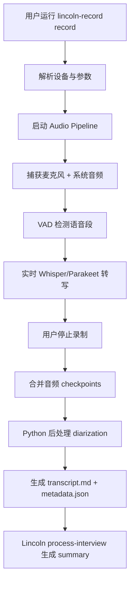
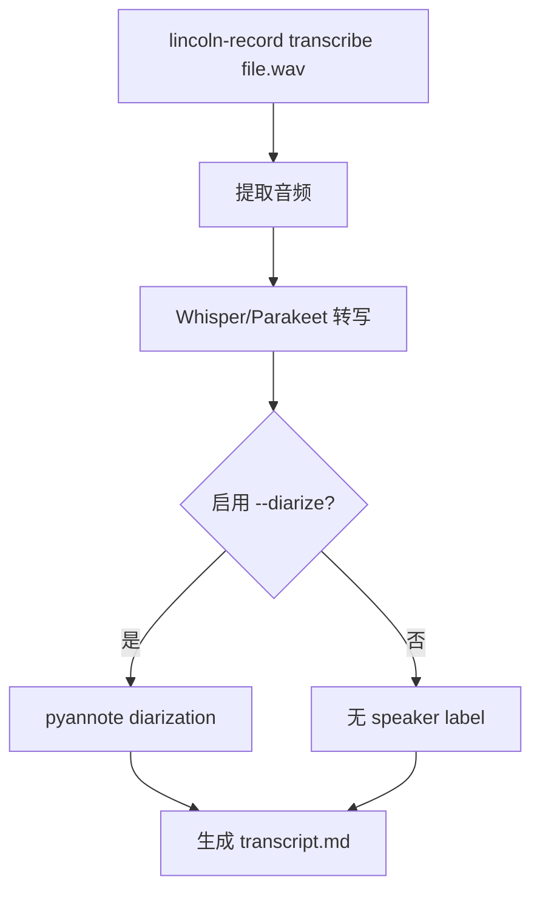

# 流程图: recording-replacement

## 主流程

## 分支流程

### 已有音频文件处理

## 状态机

- `idle` → `recording`（`record` 命令）
- `recording` → `processing`（停止录制）
- `processing` → `done`（生成输出）
- `processing` → `partial`（diarization 失败但转写成功）
