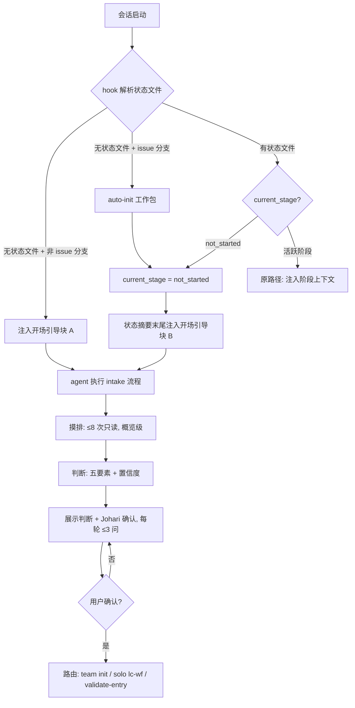
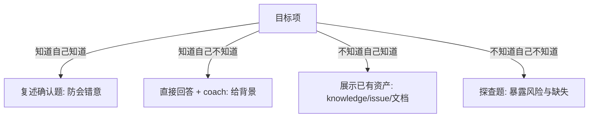
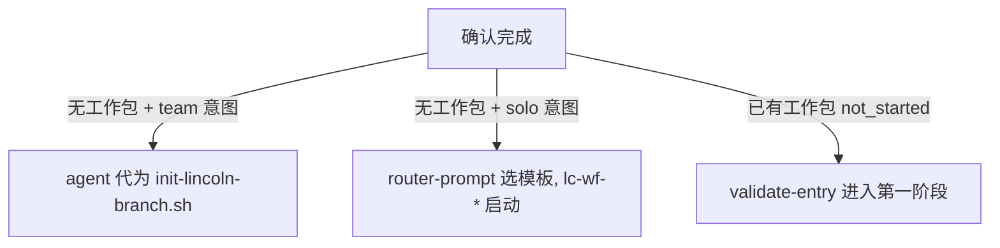

# 流程图: issue-59

<!-- status: approved -->

## 主流程

## 分支流程

### 分支一: 确认问题的象限策略

### 分支二: 路由出口

## 状态机

- 未引导 → 引导中(hook 注入开场引导块)
- 引导中 → 已确认(用户确认目标与路径)
- 引导中 → 引导中(每轮 ≤3 问,更新 lc-intake.md)
- 已确认 → 已路由(init / lc-wf-* / validate-entry 其一完成)
