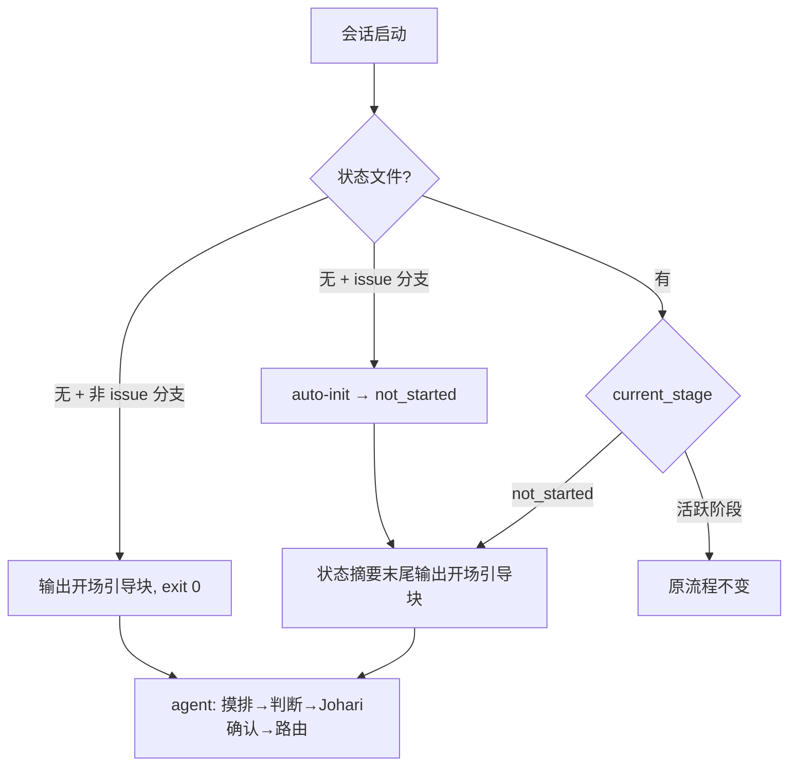

# OpenSpec 设计: session-opening-guidance

<!-- status: approved -->

## 接口 / API 变更

- hook 输出契约:新增两个注入块——`=== Lincoln 开场引导 ===`(fresh repo / issue 号不明路径,输出后 exit 0)与 not_started 版(状态摘要末尾,不中断原流程)。
- 环境变量:新增 `LINCOLN_SKIP_DEP_CHECK`(值为 `1` 时跳过依赖检测,仅用于测试密封)。
- 无 Python API 变更;`scripts/stage_loader.py` 不变。

## 数据模型变更

- 无。复用 `current_run.context_assessment`(既有约定)与 session 级 `.context/lc-intake.md`(gitignored)。

## 流程变更

## 错误处理

- `gh` 不可用:摸排跳过 issues 信号,判断中标注缺失,不阻塞。
- 信息不足:输出"信息不足"+ 最多 3 个直接问题,不编造判断。
- hook 内 auto-init 失败:保留原有失败提示路径不变。

## 依赖

- 无新增外部依赖。`lc-workflow-router` 已在 `.claude-plugin/plugin.json` 注册(第 31 行)。
