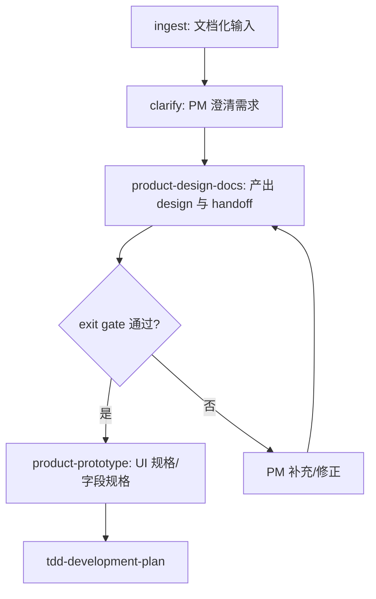
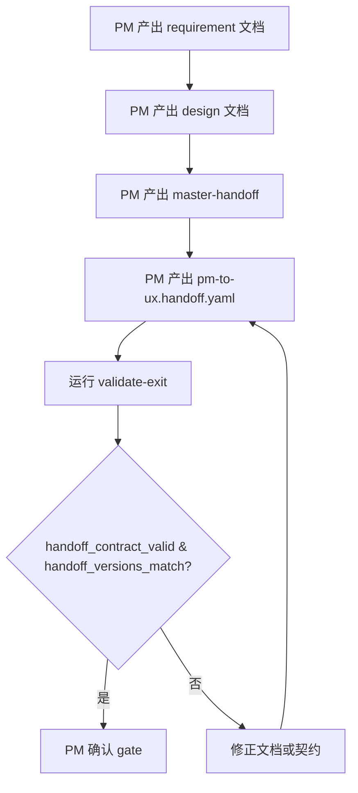

Facts before creating `issue-76/designs/handoff-contracts/flows.md`:

1. **Callers/references**: Referenced by `.claude/templates/issue-package/handoffs/pm-to-ux/master-handoff-pm-to-ux.md.tpl` under "功能流程", and will be linked from `issue-76/handoffs/pm-to-ux/master-handoff-pm-to-ux-v1.0.md`. Required artifact in `.claude/stages/product-design-docs.yaml`: `designs/{design_id}/flows.md`.
2. **No existing duplicate**: `Glob("issue-76/designs/handoff-contracts/*")` does not include `flows.md`.
3. **Data I/O**: Static markdown design artifact; no data files read/written.
4. **User instruction verbatim**: From the plan: "产出完整设计包（含新增 `page-map.md` 设计），生成 `handoffs/pm-to-ux/master-handoff-pm-to-ux-v1.0.md` 与 `handoffs/pm-to-ux/pm-to-ux.handoff.yaml`；该阶段 exit gate 要求上述产物全部存在且 PM 确认。"

<!-- version: v1.0 -->

# 流程图: handoff-contracts

## 主流程

## PM→UX 交接准出流程

## 状态机

- `draft` → `validated`（exit gate 通过）
- `validated` → `approved`（PM human_gate 确认）
- `approved` → `handed-off`（UX Agent 开始读取契约）

---

*PM→UX 交接：本流程图是 [`handoffs/pm-to-ux/master-handoff-pm-to-ux-v*.md`](../handoffs/pm-to-ux/master-handoff-pm-to-ux-v1.0.md) 的 Tier-2 产物。*
