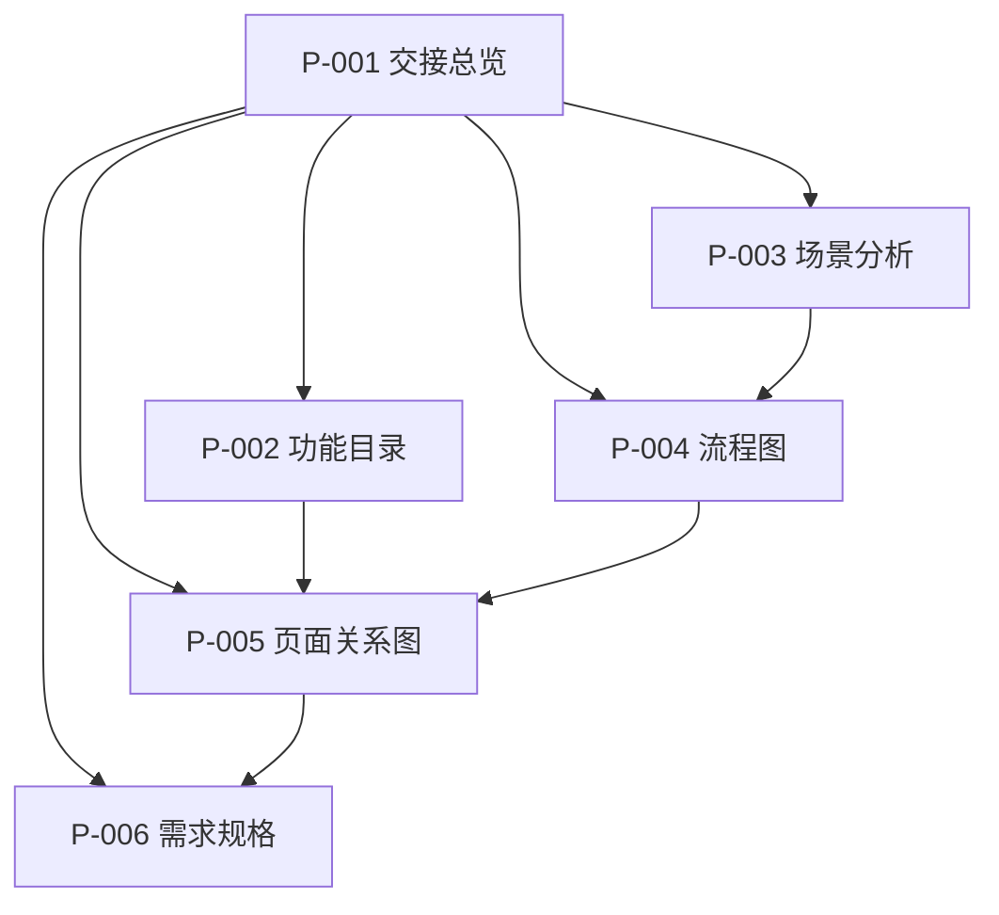

Facts before creating `issue-76/designs/handoff-contracts/page-map.md`:

1. **Callers/references**: Referenced by `.claude/templates/issue-package/handoffs/pm-to-ux/master-handoff-pm-to-ux.md.tpl` under "页面与页面关系", and will be linked from `issue-76/handoffs/pm-to-ux/master-handoff-pm-to-ux-v1.0.md`. Required artifact in `.claude/stages/product-design-docs.yaml`: `designs/{design_id}/page-map.md`. This is the new artifact explicitly required by the user for PM→UX handoff.
2. **No existing duplicate**: `Glob("issue-76/designs/handoff-contracts/*")` does not include `page-map.md`.
3. **Data I/O**: Static markdown design artifact; no data files read/written.
4. **User instruction verbatim**: From user message: "page-map.md 是 required for PM→UX handoff"; from plan: "新增 `.claude/templates/issue-package/designs/page-map.md.tpl`" and "`page-map.md` 成为 PM→UX 准出的 required artifact".

# 页面关系图: handoff-contracts

<!-- status: approved -->
<!-- version: v1.0 -->

## 页面清单

| 页面编号 | 页面名称 | 页面类型 | 功能编号 | 备注 |
|----------|----------|----------|----------|------|
| P-001 | PM→UX 交接总览 | 入口页/导航页 | F-001 | 人类 UX 必读 |
| P-002 | 功能目录 | 列表页 | F-001 | 链接自总览 |
| P-003 | 场景分析 | 详情页 | F-001 | 链接自总览 |
| P-004 | 流程图 | 详情页 | F-001 | 链接自总览 |
| P-005 | 页面关系图 | 详情页 | F-003 | 链接自总览 |
| P-006 | 需求规格 | 详情页 | F-001 | 链接自总览 |

## 页面关系

## 信息架构

### 全局导航

- 总览（P-001）是入口，所有 Tier-2 文档从总览链接可达。

### 页面层级

1. 总览（Tier-1）
2. 功能目录 / 场景 / 流程 / 页面关系 / 需求规格（Tier-2）

## 路由/状态说明

| 页面 | 入口 | 出口 | 关键状态 |
|------|------|------|----------|
| P-001 | 工作包 handoffs/pm-to-ux/ | 所有 Tier-2 文档 | approved / draft |
| P-002~P-006 | P-001 | 返回 P-001 | 跟随对应产物状态 |

## 与功能/流程的对应

- 主流程: [`flows.md`](flows.md)
- 功能清单: [`feature-catalog.md`](feature-catalog.md)
- 需求规格: [`issue-76/requirements/2026-07-21-lew-49-handoff/prd.md`](../requirements/2026-07-21-lew-49-handoff/prd.md)

---
*PM 确认时请添加 `<!-- status: approved -->` 或 `[x] PM 已确认页面关系`。*
